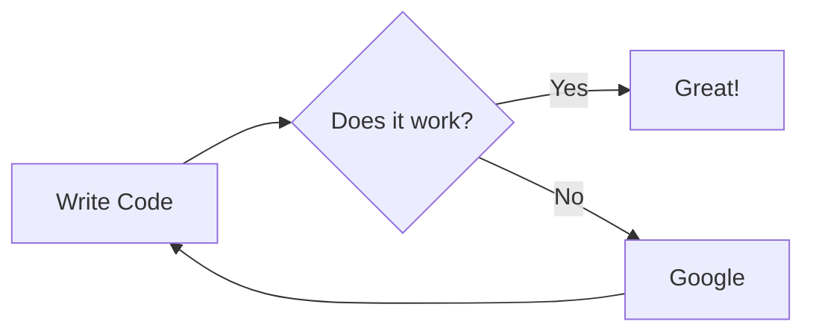

English | [繁體中文](README_TCH.md)
# Markdown_sample
A sample for markdown writing.

This originally is for my frient to learn how to write markdown. But unfortunately he is gone.

## Titles
```
# Title
## 2nd Title
### 3rd Title
```
# Title
## 2nd Title
### 3rd Title

## list
```
* List
  * item1
  * item2
```
* List
  * item1
  * item2
## Links
```
[My Website](https://jingshing.com/)
```
[My Website](https://jingshing.com/)
## Image
```

```


## Description
```
> description
```
> description

## code box
```
‵‵‵c
#include<stdio.h>
// codes

‵‵‵
```

```c
#include<stdio.h>
// codes

```

## tasks
```
- [ ] task
- [X] complete task
```
- [ ] task
- [X] complete task

## Diff
```
‵‵‵diff
+ increase
- decrease
‵‵‵
```
```diff
+ increase
- decrease
```

## Mermaid graph
> Example will display below, you can find detailed syntax online
```
‵‵‵mermaid
graph LR
	A[Write Code] --> B{Does it work?}
	B -- Yes --> C[Great!]
	B -- No --> D[Google]
	D --> A
‵‵‵
```


